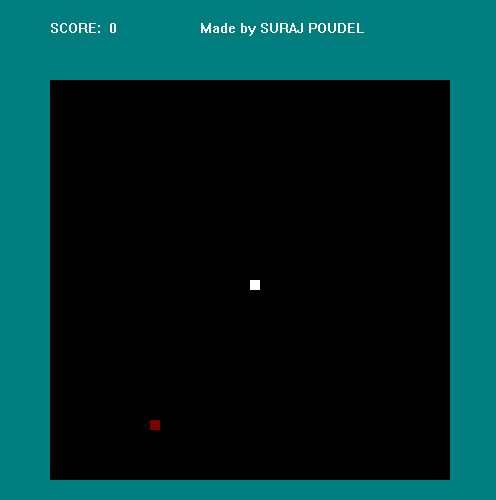

# 🐍 Snake Game
A snake game made with [Borland Graphics Interface (BGI)](https://home.cs.colorado.edu/~main/bgi/doc/) using concepts of C programming language.

## Usage
```bash
git clone https://github.com/SrjPdl/Snake.git
```
The project was made using [Code::Blocks](https://www.codeblocks.org/) IDE.
Setup tutorial for graphics.h for running the game in Code::Blocks. [Setup graphics.h](https://tejassproxy.blogspot.com/2016/06/how-to-setup-winbgim-library-in.html)

## 🎮 Controls
<!-- table -->
|Key|Action|
|---|---|
|<kbd>W</kbd>|Move snake up|
|<kbd>S</kbd>|Move snake down|
|<kbd>A</kbd>|Move snake left|
|<kbd>D</kbd>|Move snake right|

## Compiled file
`bin/release/Snake.exe`

## 💻 Demo


## 🚀Author 
**Suraj Poudel**

## License
[MIT License](https://opensource.org/licenses/MIT)
